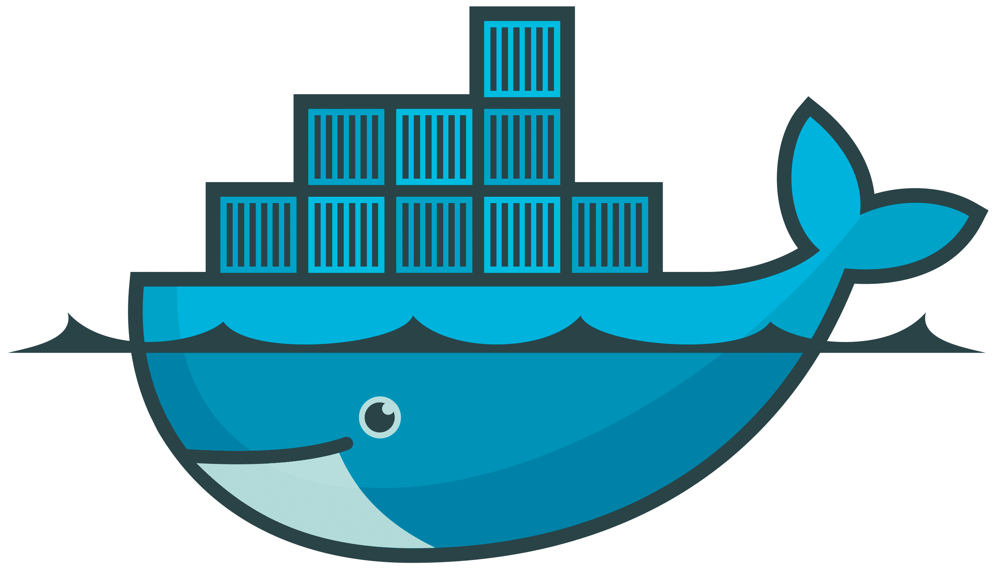

<a name="readme-top"></a>

[![Contributors][contributors-shield]][contributors-url]
[![Forks][forks-shield]][forks-url]
[![Stargazers][stars-shield]][stars-url]
[![Issues][issues-shield]][issues-url]
[![MIT License][license-shield]][license-url]

[![LinkedIn][linkedin-shield]][sadeq-linkedin-url]

<!-- PROJECT LOGO -->
<br />
<div align="center">
  <a href="https://github.com/msadeqsirjani/Navisite">
    
  </a>
  <a href="https://github.com/msadeqsirjani/Navisite">
    
  </a>
  <a href="https://github.com/msadeqsirjani/Navisite">
    
  </a>

  <h2 align="center">Navisite</h2>
  

  <p align="center">
    Hey !!
    <br />
    In This Repo We are going to Learn Some Docker, Docker-Compose And Kubernetes together
    <br />
    <a href="https://github.com/msadeqsirjani/Navisite"><strong>Explore the docs »</strong></a>
    <br />
    <br />
    <a href="https://github.com/msadeqsirjani/Navisite/issues">Report Bug</a>
    ·
    <a href="https://github.com/msadeqsirjani/Navisite/issues">Request Feature</a>
  </p>
</div>

<!-- TABLE OF CONTENTS -->
<details>
  <summary>Table of Contents</summary>
  <ol>
    <li>
      <a href="#about-the-Repository">About The Repository</a>
      <ul>
        <li><a href="#built-with">Built With</a></li>
      </ul>
    </li>
    <li>
      <a href="#getting-started">Getting Started</a>
      <ul>
        <li><a href="#prerequisites">Prerequisites</a></li>
        <li><a href="#installation">Installation</a></li>
      </ul>
    </li>
    <li><a href="#usage">Usage</a></li>
    <li><a href="#road-map">RoadMap</a></li>
    <li><a href="#contributing">Contributing</a></li>
    <li><a href="#license">License</a></li>
    <li><a href="#contact">Contact</a></li>
    <li><a href="#acknowledgments">Acknowledgments</a></li>
  </ol>
</details>

<!-- ABOUT THE PROJECT -->

## About The Repository

[![Product Name Screen Shot][product-screenshot]](https://example.com)

<p align="right">(<a href="#readme-top">back to top</a>)</p>

### Built With

List of major frameworks/libraries used to bootstrap this project.

<!-- Leave any add-ons/plugins for the acknowledgements section. -->

- [![Docker][docker]][docker-url]
- [![Linux][linux]][linux-url]
- [![Kubernetes][kubernetes]][kubernetes-url]
- [![Nginx][nginx]][nginx-url]
- [![.NET][.net]][.net-url]
- [![Postgres][postgres]][postgres-url]
<!-- * [![Docker-Compose][Docker-Compose]][Docker-Compose-url] -->

<p align="right">(<a href="#readme-top">back to top</a>)</p>

<!-- GETTING STARTED -->

## Getting Started

To get a local copy up and running follow these simple steps.

### Prerequisites

#### 1. Installing Docker and Docker-Compose

- **Note 1**: Replace **version** with the latest version number from the Docker Engine - Community repository.
- **Note 2**: For X86_64 Architecture CPUs use amd64 in place of **arch** if you are using a different architecture than x86_64, you can find the correct arch by running `uname -m` on your machine.

  - ### In Ubuntu

    1. Update Your apt

       ```sh
       sudo apt-get update
       ```

    2. Download Docker Desktop for Ubuntu

       ```sh
       wget https://desktop.docker.com/linux/main/amd64/docker-desktop-<version>-<arch>.deb
       ```

    3. Installing Docker Desktop

       ```sh
       sudo apt install ./docker-desktop-<version>-<arch>.deb
       ```

  - ### In Arch Linux

    1. Update Your Pacman

       ```sh
       sudo pacman -Syu
       ```

    2. Downloading and Installing Docker and Docker-Compose Plugin for Arch

       ```sh
       sudo pacman -S docker docker-compose
       ```

  - ### In Windows Command Prompt

    1. Download Docker Desktop With This Command

       ```sh
       Invoke-WebRequest https://desktop.docker.com/win/main/amd64/Docker%20Desktop%20Installer.exe
       ```

    2. Type Command Below For installing Docker Desktop

       ```sh
       start /w "" "Docker Desktop Installer.exe" install
       ```

### Installation

installing and setting up the app

1. Clone the repo

   ```sh
   git clone https://github.com/msadeqsirjani/Navisite.git
   ```

2. Install ... packages

   ```sh
   ... install
   ```

<p align="right">(<a href="#readme-top">back to top</a>)</p>

<!-- USAGE EXAMPLES -->

## Usage

<!-- Use this space to show useful examples of how a project can be used. Additional screenshots, code examples and demos work well in this space. You may also link to more resources. -->

_For more examples, please refer to the [Documentation](https://example.com)_

<p align="right">(<a href="#readme-top">back to top</a>)</p>

<!-- ROADMAP -->

## Roadmap

### Phase (1)

1. > Choose a Web-Server image from [Docker Hub](https://hub.docker.com/) (Like: Nginx, Apache, etc.)
   - **Nginx** is the one we are going to use in this project.
   - Downloading WebServer Image From Docker Hub
     - [ ] Downloading Nginx Image From Docker Hub
2. > Writing Dockerfile For WebServer That Do One of these Tasks :
   >
   > 1. > Acting as Reverse Proxy for a simple application.
   > 2. > Hosting an HTML Page.

- > _Note_ : First Task Can Have Extra Points For Architecture and Richer Configuration

  1. > WebServer must be able to host a Content of a Folder Outside of the Container
     - [ ] Writing Dockerfile that can host a Content of a Folder Outside of the Container
  2. > Choosing a way of Configuring the WebServer (Like: copying in image, mounting a volume, etc.)
     - [ ] ... is the one we are going to use in this project.

3. > Choose a Database image from [Docker Hub](https://hub.docker.com/) (Like: Elasticsearch, MySQL, MongoDB, etc.)
   - **PostgreSQL** is the one we are going to use in this project.
   - Downloading Database Image From Docker Hub
     - [ ] Downloading PostgreSQL Image From Docker Hub

- > _Note_ : The related image configuration must written in docker-compose.yml file that have these four features :
  >
  > 1.  > The Configuration file must be Stateful (Meaning that the data will be saved even if the container is removed)
  > 2.  > Each container must use Limited amount of resources (Like: CPU, Memory, etc.)
  > 3.  > For choosen database Define a separate username and password
  > 4.  > Need to run automatically after each system restart.
  - [ ] Downloading The Database Image From Docker Hub
  - [ ] The Related image Configuration must write

4. > By using Pervious Step Dockerfile do the build opration note that both images must run together
   - [ ] Writing docker-compose.yml File
5. > Push the built image to Docker Hub
   - [ ] Pushing The Built Image To Docker Hub
   - [ ] Putting Docker Hub Image Link In issue Phase 1

### Phase (2)

In this phase, we plan to launch a self-hosted version of kubernetes together. We suggest you minikube.

1. > At first, as always, we apply the update command
```bash
sudo apt-get update
```

2. > At first, as always, we apply the update command
```bash
sudo apt-get install curl
```

3. > In continuation of the previous case, the binary installation files are downloaded from the domains with the http tag, and what is better is to enter the following command as well.
```bash
sudo apt-get install apt-transport-https
```

4. > As you know, to install minikube, you must use the hypervisor feature and install a version of virtual box on your operating system. This can be done as follows
```bash
sudo apt install virtualbox virtualbox-ext-packs
```

5. > In this step, we download the minikube installation binary files
```bash
wget https://storage.googleapis.com/minikube/releases/latest/minikube-linux-amd64
```

6. > In order to be able to apply the commands related to the execution of minikube, we must move the executable files to the following path.
```bash
sudo cp minikube-linux-amd64 /usr/local/bin/minikube
```

7. > We give the necessary access to the executable files of minikube as follows.
```bash
sudo chmod 755 /usr/local/bin/minikube
```

8. > Now we have installed minikube and we can enter the following command in the command line to check the correctness of the program installation.
```bash
minikube version
```

9. > There are 3 ways to communicate with minikube. The most important and powerful method is to use command line commands or kubectl
```bash
curl -LO https://storage.googleapis.com/kubernetes-release/release/$(curl -s https://storage.googleapis.com/kubernetes-release/release/stable.txt)/bin/linux/amd64/kubectl
```
> With the above command, we download the kubectl binary installation files.

10. > The necessary access to the kubectl executable is given as follows
```bash
chmod +x ./kubectl
```

11. > We move the kubectl execution file to the execution path of other programs.
```bash
sudo mv ./kubectl /usr/local/bin/kubectl
```

12. > We have now installed kubectl. We can make sure of the correct performance by executing the following command
```bash
kubectl version -o json
```

13. > By running the following command, minikube will run on a virtualbox
```bash
minikube start
```

14. > You can connect to minikube using kubectl using the following commands
```bash
kubectl config view
kubectl cluster-info
kubectl get nodes
```

15. > At the end, you can get the necessary information from the latest status of minikube with the following command
```bash
minikube status
```


See the [open issues](https://github.com/msadeqsirjani/Navisite/issues) for a full list of proposed features (and known issues).

<p align="right">(<a href="#readme-top">back to top</a>)</p>

<!-- CONTRIBUTING -->

## Contributing

Contributions are what make the open source community such an amazing place to learn, inspire, and create. Any contributions you make are **greatly appreciated**.

If you have a suggestion that would make this better, please fork the repo and create a pull request. You can also simply open an issue with the tag "enhancement".
Don't forget to give the project a star! Thanks again!

1. Fork the Project
2. Create your Feature Branch (`git checkout -b feature/AmazingFeature`)
3. Commit your Changes (`git commit -m 'Add some AmazingFeature'`)
4. Push to the Branch (`git push origin feature/AmazingFeature`)
5. Open a Pull Request

<p align="right">(<a href="#readme-top">back to top</a>)</p>

<!-- LICENSE -->

## License

Distributed under the MIT License. See `LICENSE` for more information.

<p align="right">(<a href="#readme-top">back to top</a>)</p>

<!-- CONTACT -->

## Contact

Mohammad Sadeq Sirjani - [@msadeqsirjani](https://twitter.com/msadeqsirjani) - m.sadeq.sirjani@gmail.com

Project Link: [https://github.com/msadeqsirjani/Navisite](https://github.com/msadeqsirjani/Navisite)

<p align="right">(<a href="#readme-top">back to top</a>)</p>

<!-- ACKNOWLEDGMENTS -->

## Acknowledgments

- [Docker-Compose](https://docs.docker.com/compose/)
- [Dockerfile](https://docs.docker.com/engine/reference/builder/)
- [Choose an Open Source License](https://choosealicense.com)
- [Malven's Flexbox Cheatsheet](https://flexbox.malven.co/)
- [Malven's Grid Cheatsheet](https://grid.malven.co/)
- [Img Shields](https://shields.io)
  <!-- * [GitHub Emoji Cheat Sheet](https://www.webpagefx.com/tools/emoji-cheat-sheet) -->
  <!-- * [GitHub Pages](https://pages.github.com) -->
  <!-- * [Font Awesome](https://fontawesome.com) -->

<p align="right">(<a href="#readme-top">back to top</a>)</p>

<!-- MARKDOWN LINKS & IMAGES -->
<!-- https://www.markdownguide.org/basic-syntax/#reference-style-links -->
<!-- https://ileriayo.github.io/markdown-badges/ -->

<!-- Contributors -->

[contributors-shield]: https://img.shields.io/github/contributors/msadeqsirjani/Cloud-Computing-Project.svg?style=for-the-badge
[contributors-url]: https://github.com/msadeqsirjani/Cloud-Computing-Project/graphs/contributors

<!-- Forks -->

[forks-shield]: https://img.shields.io/github/forks/msadeqsirjani/Cloud-Computing-Project.svg?style=for-the-badge
[forks-url]: https://github.com/msadeqsirjani/Cloud-Computing-Project/network/members

<!-- Stars -->

[stars-shield]: https://img.shields.io/github/stars/msadeqsirjani/Cloud-Computing-Project.svg?style=for-the-badge
[stars-url]: https://github.com/msadeqsirjani/Cloud-Computing-Project/stargazers

<!-- Issues -->

[issues-shield]: https://img.shields.io/github/issues/msadeqsirjani/Cloud-Computing-Project.svg?style=for-the-badge
[issues-url]: https://github.com/msadeqsirjani/Cloud-Computing-Project/issues

<!-- License -->

[license-shield]: https://img.shields.io/github/license/msadeqsirjani/Cloud-Computing-Project.svg?style=for-the-badge
[license-url]: https://github.com/msadeqsirjani/Cloud-Computing-Project/blob/master/LICENSE.txt

<!-- Linkedin -->

[linkedin-shield]: https://img.shields.io/badge/linkedin-%230077B5.svg?style=for-the-badge&logo=linkedin&logoColor=white
[sadeq-linkedin-url]: https://www.linkedin.com/in/msadeqsirjani/

<!-- Product-Screenshot -->

[product-screenshot]: images/screenshot.png

<!-- Kubernetes -->

[kubernetes]: https://img.shields.io/badge/kubernetes-%23326ce5.svg?style=for-the-badge&logo=kubernetes&logoColor=white
[kubernetes-url]: https://kubernetes.io/

<!-- Docker  -->

[docker]: https://img.shields.io/badge/docker-%230db7ed.svg?style=for-the-badge&logo=docker&logoColor=white
[docker-url]: https://www.docker.com/

<!-- Docker-Compose -->

[docker-compose]: https://img.shields.io/badge/dockercompose-35495E?style=for-the-badge&logo=dockercompose&logoColor=4FC08D
[docker-compose-url]: https://docs.docker.com/compose/

<!-- .NET -->

[.net]: https://img.shields.io/badge/dotnet-4122aa?style=for-the-badge&logo=dotnet&logoColor=fbfbfb
[.net-url]: https://dotnet.microsoft.com/en-us/

<!-- Nginx -->

[nginx]: https://img.shields.io/badge/nginx-%23009639.svg?style=for-the-badge&logo=nginx&logoColor=white
[nginx-url]: https://www.nginx.com/

<!-- Linux -->

[linux]: https://img.shields.io/badge/Linux-FCC624?style=for-the-badge&logo=linux&logoColor=black
[linux-url]: https://www.linux.org/

<!-- Postgres -->

[postgres]: https://img.shields.io/badge/Postgres-31648c.svg?style=for-the-badge&logo=Postgres&logoColor=white
[postgres-url]: https://www.postgresql.org/
